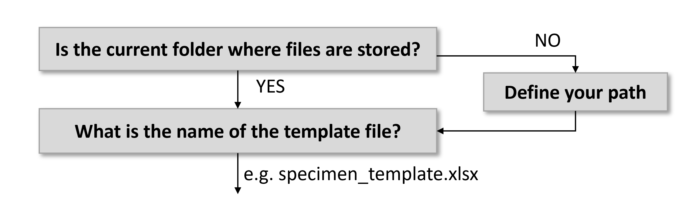
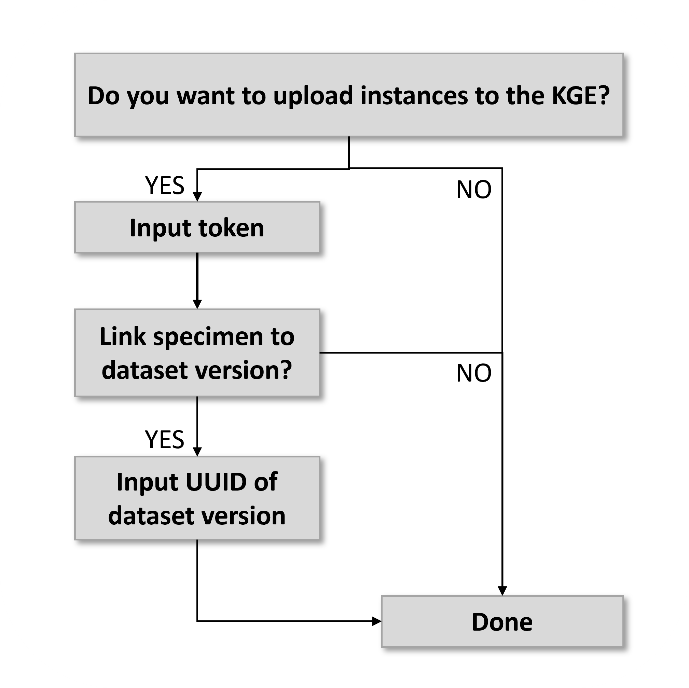

# Instructions MetaBot demo #
*Instructions on how to use MetaBot to generating instances automatically using the demonstration file*

For general information and instructions on how to install the package, please read the README file.

In the example folder there is a file called "demo_createSpecimen.py". With this script you can create subjects and samples automatically by importing metadata from a template excel file.

## How to use ##

To create instances for samples (either tissue sample or tissue sample collections) from subject that are already in the KG editor, you need to following files:
- ``example_template.xlsx`` (template file provided)
- ``demo_createSpecimen.py`` (python script to create the instances)

### Template .xlsx file: ###

The template file allows you to create subject groups, individual subjects, tissue sample collections and individual tissue samples. You select the specimen type of your interest under "specimenType" and the excel file will black out the fields that are not relevant for that specimen.

**Note: Required fields are indicated with *.**

Put one specimen on one row. If the specimen has multiple states (time points) for which metadata is available, create a new row for each of these states.

#### Specimen information ####
- ``specimenType*:`` Select a specimen:\
"subject group" = a group of individuals with a common characteristic,\
"subject" = individual subject,\
"tsc" = tissue sample collection,\
"ts" = tissue sample
- ``name*:`` Choose the name of the specimen. This will become the lookupLabel in the editor.
- ``internalID:`` Specify the specimen name used in the naming convention (this would ideally matches file bundles). if left empty, no internal identifier will be added.
- ``strainName:`` Choose a strain that is currently already in the system (these are "semi-controlled terms at the moment"). If you want to add a strain that is not already in the system, leave this blank.
- ``strainAtid:`` DO NOT fill in this field. This field will be filled in automatically based on the strain name that is chosen.
- ``timePoint*:`` number of the state for a particular subjects. Each state will have to be put in on a different row to ensure that specific metadata can be added to that time point (e.g. weight, age, attribute)
- ``timePointName:`` if left empty, states are named as follows: "state-01", "state-02", etc. For any other name, please define the name here.
- ``biologicalSex:`` Enter the biological sex of the subject. If unknown, leave blank.
- ``ageCategory*:`` Choose the age category from the dropdown list.
- ``ageValue:`` Define the age value
- ``ageUnit:`` Choose the age unit from the dropdown list.
- ``weightValue:`` Define the weight value
- ``weightUnit:`` Choose the weight unit from the dropdown list.
- ``pathology:``  Choose the pathology (disease or disease model) from the dropdown list.
- ``attribute:`` Choose a subject attribute from the dropdown list. Leave empty if not applicable.
- ``region:`` Select the brain region the sample is anchored to. Check [SANDS extension](https://humanbrainproject.github.io/openMINDS/v3/) for proper notation. Include everything starting with "AMBA" or "WHS". This will be used to figure out if parcellationEntity or parcellationEntityVersion needs to be used.
- ``origin:`` Select the origin of the samples. This could be organ (e.g. brain), or cellType (e.g. neuron).
- ``quantity:`` define the number of samples in the collection (only applies to tsc)
- ``isPartOf:`` If a subject or tissue sample is part of a subject group or tissue sample collection, respectively, define the name of the group here.
- ``descendedFrom:`` If the specimen descends from another specimen (e.g. tissue sample from subject), define the state of the specimen it descends from.

For more information about what controlled terms are available, see the [wiki](https://humanbrainproject.github.io/openMINDS/v3/).

**NOTE: Save the template file as an .xlsx file.**

## Running the python script ##

You can run the python script from the command line, or from software that allows you to execute python scripts, e.g. spyder (in Anaconda) or Visual studio code.

The easiest is if you put the script in the same folder as the subject and specimen template files, but this is not necessary. The script will ask you a number of questions according to the following decision tree:

Additional information to answer the questions:
1. "Is this where the files are stored?" < It prints the path to where the python file is located. If all files are in the same folder, press "y". If this is not the case, you can define the path yourself by answering the next question: "Please define you path: ".
2. "What is the name of your specimen info file (e.g. specimen_template.xlsx)? " < Please specify the name of your sample info file. Make sure you saved it as a .xlsx file. The ".xlsx" does not have to be added when you provide the name.

The script updates you on which instances are being created and whether information is missing. If information is required and not found in the template file, it tells you to go back to the file and check if the information was entered correctly.

## Uploading the instances to the KGE ##

Once the instances are created, the script asks whether you would like to upload these instances directly to the KGE. To upload the instances to the KGE, you will need to be authorised to do so. If you are, you can use the authentication token generated by the KGE or query builder.

  

Additional information to answer the questions:
1. "Do you want to upload the instances to the KGE?" < If yes, press "y". You will proceed to the next question. If this is not the case, you can press "n" and your are done. Instances can be uploaded later using the upload function of MetaBot (see ex3.py). **Note: If you made a mistake, you can use ex4.py to remove the uploaded instances.**
2. "Please copy your input token: " < The authentication token can be found under your account in the KGE or query builder.  Pressing on the account symbol in the top right corner of the KGE or query builder, and select "copy token to clipboard". Paste the token as response to this question.
3. When the instances are uploaded to the KGE, the script prints whether it was successful, or whether there are any authentication issues (e.g. error code 401), or whether the instance already exists in the Knowledge Graph (i.e. error code 409).
If you get a "401" error, please refresh your browser and copy a new token (tokens are only valid for a short amount of time). In this case, do not rerun the demo script, since this will create new instances. Instead, use the example script ex4.py.
4. Once the instances were uploaded, you are asked whether you want to add the specimen you created to a particular dataset version. If "y", then provide the UUID of the dataset version (and your token) and the instances will be automatically added.

### Contributors ###

Maaike M.H. van Swieten (mvanswieten@outlook.com)

### License ###

GNU LGPL, version 3.
